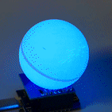

# WiFi-Christmas-Ornament

## WiFi enabled color changing christmas ornament
A RGB-LED illuminated festive ping pong ball - controllable via http or shell script.

## Problem
Your christmas tree is not nerdy enough - no LEDs at all. You need a christmas ornament which is controllable via http or shell script!

## Hardware
* Wemos D1 mini ESP8266 (or compatible)
* WS2812 RGB shield (or compatible)
* Ping pong ball

Connect the RGB shield to the Wemos D1 mini (probably you have to solder connectors first).
Then affix the ping pong ball to the RGB LED. I cut a hole into the ball and snapped it over the LED, which works perfectly for me. The ping pong ball diffuses the light, looking very nice.

## Firmware
The firmware implements a basic http server which checks for the GET parameters *r*, *g* and *b* an sets the RGB colors accordingly.
Add your local WiFi network(s) SSIDs and credentials to the source code. After compile/upload the *Ornament* should join your WiFi network. Find out the IP address either via the serial console or with some WiFi monitor.

## Shell script
Add the IP address of the ornament to *christmas.sh* and start the shell script. The color should change randomly every two seconds.

## Enjoy!
